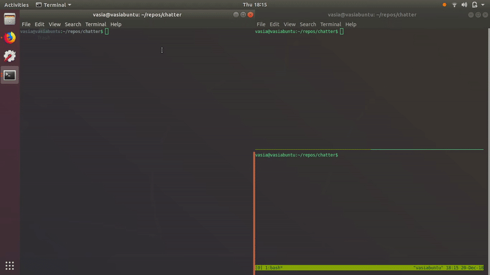
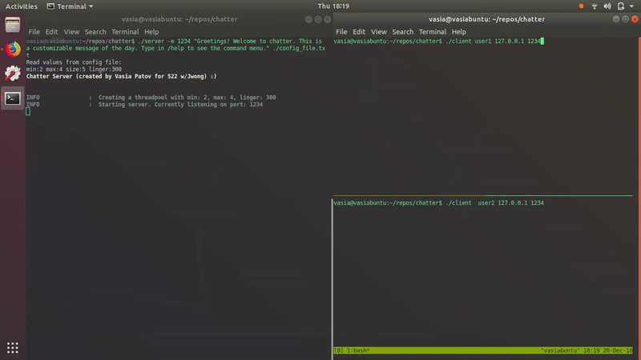
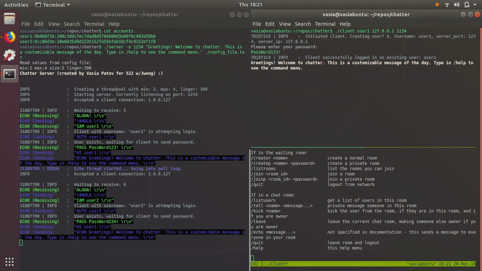

_(This was part of my gradaute coursework in the M.S. Computer Science program at Stony Brook, 2017)_

Welcome to Chatter, a simple multithreaded Chat Client/Server that follows the PIRC protocol (RFC 943343 pending), and uses its own implementation of workers/thread pool.

The usage is as described in the HW specifics. To reacquaint yourself with the required arguments, simply run ./server or ./client without arguments to get a printout of their usage. Or for your convenience, there are two bash scripts, client.sh and server.sh in which you can store commonly used arguments.

The color coding is self-explanatory mostly.
On the server side, in echo mode, data being sent is in blue, data received is green.
Errors are in red.
Debug warnings are in purple
Info printouts are in light blue - mostly about users coming and going, connecting/disconnecting.

On the client side,
private messages are in purple
server command responses are in white (LISTR, LISTU, MOTD)
server echoes are light blue
error responses are in red
chat room echos (a user in a chat room messages everyone in the chat room) is in yellow.

I did not get do /logdump and logging. Apart from that, I believe everything is in order. I tested the application to simulate various race conditions, using multiple tmux terminals and sending commands to all of them simultaneously. User creation, user login, room creation, room joins, user leaves, all worked fine :)

There are just under ~3000 LOC (excluding whitespace, comments, but including header files and makefiles).
I had a lot of fun working on this.

Please don't hesitate to e-mail me if there are any questions or concerns!
vasiapatov@gmail.com

Some gifs of example program usage:

- First time initialization and user creation:

- Failed login attempt followed by successful attempt:

- Creating a chat room, having another user join it, and then chatting:

